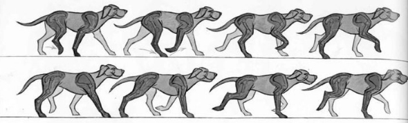

   

Building a Robot Dog based on

openDog project

****

Training report of Robotic 4th year

Submitted by:

Zain Bin Sumait

Major : Robotics and instrumentations

Performed in the engineering polytechnic school affiliated to the university of Santiago de Compostela from 04/04/2022 to 31/07/2022

Supervisor : Dr. Enrique Comesaña Figueroa

University tutor : FAUVET Eric

University year 2021-2022

######### **Table of Contents** #########

[I	Introduction:	4](#_Toc106573279)

[II	University :	5](#_Toc106573280)

[III	Environment and planning	5](#_Toc106573281)

[IV	General Concept :	6](#_Toc106573282)

[V	Chapter 1 : Mechanical part	6](#_Toc106573283)

[V.i	Original design	6](#_Toc106573284)

[V.ii	Modifications to the original design	7](#_Toc106573285)

[V.ii.1	Pieces to adapt with the electronic components used	7](#_Toc106573286)

[V.ii.2	Improvements Made	8](#_Toc106573287)

[V.iii	kinematic model	9](#_Toc106573288)

[VI	Chapter 2 : Electronic components	11](#_Toc106573289)

[VI.i	Motor Aj90-30	11](#_Toc106573290)

[VI.ii	Encoder	11](#_Toc106573291)

[VI.iii	Odrive board – High performance motor control	12](#_Toc106573292)

[VII	Chapter 3: Programming and control system	13](#_Toc106573293)

[VII.i	Movement of a real dog vs robotic dog	13](#_Toc106573294)

[VII.ii	Control method	13](#_Toc106573295)

[VII.ii.1	Configuration and calibration process :	14](#_Toc106573296)

[VII.ii.2	PID controller :	14](#_Toc106573297)

[VII.iii	Control system	15](#_Toc106573298)

[VII.iii.1	Balance movement	15](#_Toc106573299)

[VII.iii.2	Forward movement	15](#_Toc106573300)

[VII.iv	Gazebo simulation :	15](#_Toc106573301)

[VIII	General conclusion	16](#_Toc106573302)

[IX	Bibliography	17](#_Toc106573303)

- Acknowledgment

I would like to thank Mr. Enrique Comesaña Figueroa, my internship supervisor, who had the patience and the pedagogy to accompany me during the whole period of my internship. His strictness and availability made this internship a strong and enriching experience. I would also like to thank Mr. Roberto Iglesias Rodriguez, who was the second supervisor of this internship, for the help and the precious information he provided. I thank Mr. David Fofi and Mr. Eric Fauvet as well for giving me this opportunity.  

# Introduction:

In the art of conception, designers are inspired by living beings to build the design which is called biomimetic. Almost every time they copy an animal to have its features (plane conception for example which has been inspired by a bird). This phenomenon gives the possibility to overcomes the limitation of a classic design [1]. 

Dogs have the capability to move freely in any environment, they are flexible, strong, and adorable. A robotic dog can easily gain access to certain hard-to-reach places and can also work in a difficult environment. Besides that, the fabrication process includes multiple aspects in more than one domain, it includes deep notions in mechanics, electronics, programming, physic, movement study, automatic, control, and analytics. Improving my skills and experience in this project was the principal reason for choosing this internship. 

A new robotics program was launched at Lugo campus (a city one hour from Santiago) in 2019. To enrich this program and help students learn as well as provide more options for the final project, a diversity of robots is available such as Nao, Pepper, and TurtleBots. The main reason for building this robotic dog is that it could be more challenging to the students by providing an additional dimension and more practice. 

The project is based on the second version of an open-source project created by James Bruton, an English former toy designer, current YouTube maker and general robotics, electrical and mechanical engineer. His project called openDog has three different versions with some improvements in each version [2]. The 3D design and all the components used in this project are available on his GitHub [3], but it is not possible to edit this design which is in STL format. However, the design and the electronic parts must be adapted to our robot's educative goal (easier to dismount with less expensive parts). Consequently, last year, a student created the same design in Fusion 360 to be edited later. The core of the project is building this robot while applying modifications and improvements to the system which requires a good analytical sense and a critical thinking. These modifications include edit the mechanical design for more stability and ease of dismounting and mounting, replacing certain electronic component, and reducing complexity and price.

# University :

The University of Santiago de Compostela - USC is a public university located in the city of Santiago de Compostela, Galicia (northwest region of Spain). A second campus is in Lugo (one hour east of Santiago). It is one of the world's oldest universities in continuous operation. From 1445 till now, it has offered degrees with nineteen faculties in the following fields: Health Sciences, Physical Sciences, Social Sciences, Technical, and Humanities [4].

The internship site is located in the Polytechnic School of Engineering on the earth campus of Lugo where the robotics program degree is taught.   

 # General Concept :

Inspired by the biological dog, Spot (the most famous robotic dog) was created by Boston Dynamics. Likewise, inspired by Mr. James Bruton’s open-source project,  this project has been launched to build this dog. The concept from the beginning is how to create a robotic dog strong as a robot and flexible and fast as a dog. The combination of two contradictory features makes its fabrication cycle more complex (control legs, balance, and movement) and more expensive (energy consumption, precision, more motors) than the regular wheeled robot [1]. 

The robot consists of a body and four legs. Each leg has three motors and three encoders, one motor represents the knee joint and two for the hip (one rotates around the same axis as the knee and the second around the body axis). The two motors are controlled by an Odrive board. In total, the robot has 12 brushless motors, 12 encoders for the position feedback, 6 Odrive boards, an IMU sensor in the centre of the body for balance feedback, a mother board (an Arduino or a Raspberry Pi ), and 7 power supplies (one for each board and the 7th for the mother board and IMU sensor) [5]. 

# Chapter 1 : Mechanical part
 

## 1. Original design
The major features required are lightweight and robustness which can be provided with a 3D printer. Around 80% of the design is a 3D printed PLA with some Flex filament for the feet. Aluminium is used for bar links as well as carbon fibres to add more stability and durability. The initial design created by James Bruton is illustrated in figure 2.

The dog design is inspired as well from Boston Dynamics Spot. Most of the weight is in the body to have more control and easy balance. In the middle part there are seven batteries, four motors for the hip rotation, motherboard (Arduino or Raspberry Pi), all the 6 Odrive Boards, cables and the IMU sensor.

The leg has three parts : hip part, upper leg, and lower leg. One motor is in the hip part to control the upper leg rotation. Another one is in the upper leg to control the rotation of the lower leg. The lower leg has no electronic components with a carbon fibre tube as a connection between the foot and the lower leg to make it as light as possible and concentrate the weight closer to the centre of the body. To this point no modifications were made, the first test leg was printed to discover the spots to edit.

 ## 2. Modifications to the original design

 ### 1. Pieces to adapt with the electronic components used 

In this project, we did not use the same motors (as mentioned in the electrical part) because of its unavailability. We used ABB aj90-30 which does not have the same design as the original one. Hence, a new pulley (figure 4) had to be created for this motor which in the end has more teeth than the original. Therefore, the belt reduction changed. We also needed to adapt the belt length in order to have a tighter belt without transmission power lose. Both driven gears have seventy teeth which gives a gear reduction of 70:28 for the upper leg and 70:32 for the lower leg. The difference between the two pulleys is because the distance from the pulley centre to the driven gear centre is not the same in the hip and in the upper leg. 500mm HTD belt is used in the hip on the other side 665mm HTD belt.    

![[Aspose.Words.bcef06b6-277f-4471-8e70-583fbaecc916.009 1.png]]
*Figure 4: motor pulley*
`  `Hip / upper leg

`  `Number of teeth : 28 /32

`  `Diameter = 43 mm / 50 mm

`  `Gear reduction: 70:28 / 70:32

The second piece is the magnetic holder. A round magnet needs to be held at a certain distance (see the encoder part in the electrical chapter) from the encoder chip and should turn with the motor. So, a piece that will attach the magnet with the motor needs to be designed. The original piece cannot be used as the motor is not the same. The motor has a different shape in the lower part which makes attaching a piece with the turning part exceedingly difficult (figure 5). A round base piece has been designed and attached to the turning part using Cyanoacrylate glue. Although, it is not efficient way, it is the easiest and the appropriate for this part which will turn freely without any friction. Alternatively, a metal part should be soldered to the turning part and then attached to the plastic piece.

![[Aspose.Words.bcef06b6-277f-4471-8e70-583fbaecc916.012 1.jpeg]]

![[Aspose.Words.bcef06b6-277f-4471-8e70-583fbaecc916.013 1.png]]

- The support:

![[Aspose.Words.bcef06b6-277f-4471-8e70-583fbaecc916.014 1 1.png]]

*Figure 6: support*

A support to hold this test leg during the test needed to be designed as well. It consists of a wooden base and two metal bars with 3D Printed pieces. Two pieces were designed to block or allow the movement of the hip (figure 6).

 ### 2. Improvements Made

![[Aspose.Words.bcef06b6-277f-4471-8e70-583fbaecc916.016 1 1.png]]
*Figure 7: adding nuts to the design*

Improving the design to fit the educational purpose was a part of the internship. The robot must be durable, stable, less expensive and withstand the cycle of mounting and dismounting for a long duration. After testing the first leg, we have these remarks:

- There’s a slight movement in the leg while it moves.
- Using screws to fix the leg parts makes it less durable with the mounting and dismounting cycle. Because the original design was based on wood self-drilling screws which become looser every time it got dismounted.

Consequently, to give more stability and durability to the design we made these changes:

- Put metric bolt with nuts instead of a simple screw: add the emplacement for the nuts and adapt the design for this modification (figure 7).

![[Aspose.Words.bcef06b6-277f-4471-8e70-583fbaecc916.019 1.png]]
*Figure 8: section view of the upper leg  rotation axis*

Make the rotation axis of the upper leg more stable and easier to dismount by adding a blind flange in the other side with a thread bar gathering these sides (figure 8) and use the same linking concept with the lower leg and its rotation axis (figure 9).

![[Aspose.Words.bcef06b6-277f-4471-8e70-583fbaecc916.021 1.png]]

*Figure 9: modification in the lower leg rotation axis*

With these modifications, we ended up with a stable and easy-to-dismount design. 

 ## 3. kinematic model 

![[Aspose.Words.bcef06b6-277f-4471-8e70-583fbaecc916.023 1.jpeg]]
*Figure 10: 2D sketch of the leg with coordinate system*

An inverse kinematic model is essential for the controlling system to know exactly what the angle of both the motors should be in order to reach a specific position [6].

A 2D kinematic model of the leg was developed (figure 10) and here is the calculation part:

The orthogonal coordinate system of the base R0 which has the x axis down and the y toward the front. In the end the position of the leg through the x axis is (420,0). D is the length of the lower leg and L for the upper leg.

Two rotations and one translation from R0 to R2, the transformation matrix after the calculation will be:
![[Aspose.Words.bcef06b6-277f-4471-8e70-583fbaecc916.024 1.png]]

With the position equations, a specific position can be chosen as an input and alpha and beta will be the output. A specific angle can be imposed to facilitate the process. 

To have a good balance while walking, the robot should move its legs up and down regularly or periodically. While keeping the same position the foot must remain in x axis during the up-down movement. The feet will go through the y axis to move forward and in the negative side to backword. 

*Figure 11: Graph relates alpha, beta, and the distance x*

The movement through the w axis is represented by the figure 11 , and the relation between the three parameters (coordinate in x, alpha and beta). 

These angles are in degrees. The following equation can be used to convert these angles in a motor rotation and use these results as an input of the motor incremental [(See the programming part) :](#_Forward_movement)

Rotation of the lower leg  = beta \* 70 32\*1360           where 70/32 is the Gear reduction

The same for the rotation of the upper leg = alpha \* 70 28\*1360  These results are used in the python code. 

Another option to have the transformation matrix is to use the Denavit-Hartenberg method which consists of creating DH table (Table 1) from the coordinate system of the base R0 until R2 then obtaining the transformation matrix using a MATLAB code .

||a|α|d|θ|
| - | - | - | - | - |
|1|0|0|0|Θ1|
|2|L|0|0|Θ2|
|3|D|0|0|0|

*Table 1: Table of Denavit-Hartenberg*

# Chapter 2 : Electronic components

The crucial factor is the complexity and the price. An easy-to-use component is expensive most of the time. The board and the encoder of the original design were used, but not the same motors. In this chapter, all the components and all their configurations will be mentioned.

 ## 1. Motor Aj90-30

![[Aspose.Words.bcef06b6-277f-4471-8e70-583fbaecc916.027 1.jpeg]]
*Figure 12: Aj90-30 motor*

This is a powerful three phases brushless motor which supports until 58 (A) of current and 2600 (W) of power. It has the same size as the original one and thus avoids extra modification in the design. However, it is less expensive than the original one by one hundred euros. It is a lighter motor also with a weight of 416 g. 

 ## 2. Encoder 

![[Aspose.Words.bcef06b6-277f-4471-8e70-583fbaecc916.030 1.jpeg]]

*Figure 13: AS5047P encoder*

AS5047P is a high-resolution rotary position hall effect sensor for fast absolute angle measurement over a full 360-degree range (figure 13). It can send a precise data for the rotation angle of a magnet placed near the chip. It comes with a round magnet which allows it to have the rotation angle. However, this magnet must be placed over or under the encoder chip with airgap maintained in the range 0.5mm to 3mm and should be centred on the middle of the package with a tolerance of 0.5mm (figure 14). The magnet holder must not be ferromagnetic as well.

![[Aspose.Words.bcef06b6-277f-4471-8e70-583fbaecc916.031 1.png]]
*Figure 14: emplacement of the magnet*

This encoder can be used with Arduino by standard 4-wire SPI serial interface. Therefore, it has ABI Incremental Interface that is used for Incremental movements. It sends a programable signals until 2048 steps per revolution [7]. 

This interface is used to send the rotation information to the Odrive board by connecting the ports : A, B and I to the A, B and Z inputs of the board as well as the ground and 5V port (figure 15).

*Figure 15: encoder-Odrive connection*

To test the encoder, an Arduino was used directly with it. By rotating the magnet above, the chip will read angle changes. 

 ## 3. Odrive board – High performance motor control

*Figure 16: Odrive board*

Odrive Board (figure 16) is designed by Odrive Robotics society to control high current brushless motors with a high precision using encoder feedback. It can handle until 100 A peak and deliver more than 1kW per motor channel. It is based on the STM32 microcontroller for the high-level control and the DRV8301 three-phase driver to control the power electronics. The board has a firmware built in which supports multiple features including :

- Position, Velocity, and Current control modes.
- Automatic identification of motor parameters (Inductance, Resistance).
- Realtime USB communication (>4000 floats/sec) to Python host program.

More than one type of communication is supported by this board. USB, UART or Step/direction can be used to control it by a PC, Raspberry Pi, Arduino, or other hardware. However, first, the board must be connected to a computer in order to flash or simply test that it’s working [8].

The board is enormously powerful and provide features that could not be used for this project. Therefore, the next testing leg will have another controller. Trying to replace this two hundred euros-board with a cheaper solution is one of tasks of this internship. With an esc controller and a current controller this is possible. The board connects to two motors, two encoders, a brake resistor, a power supply and a microcontroller or PC (figure 17). 

![[Aspose.Words.bcef06b6-277f-4471-8e70-583fbaecc916.045 1.png]]
*Figure 17: board connection*

# Chapter 3: Programming and control system

A movement of a robotic dog is quite different from the real one. To simulate the same movement exactly, enormously powerful components and a stable balance are required as well as an AI program. In this project, for now, one leg is available for a movement test. However, the control system of the entire robot will be discussed in this chapter. 

 ## 1. Movement of a real dog vs robotic dog
## 
A real dog has six moving styles: walk, amble, pace, trot, canter, gallop. In this part, the walk style will be studied to simulate it programmatically. Dog walking cycle has eight positions (figure 18) in each of them there are three or two legs touching the ground with a ¾ delay between front and rear legs. All the legs perform the same movement but this offset in the frequency of each one creates the movement forward. 

*Figure 18: dog walking cycle*

To make the robotic dog walk, there are two methods. Either the real dog method that requires the capability of having a balance using just two legs, or a high frequency continuous up-down movement of four legs with a delay of ½ between the cross legs. Although the first method is smoother and more stable, it includes complex control system, high precision components and a precise position of the centre of the body mass which increases the overall cost of the robot. The second method avoids the complexity by repeating this balance movement to avoid falling even if the centre of the mass is not in the centre of the body.

 ## 2. Control method 

Odrive board provides multiple control modes with multiple trajectory control modes. After the board is configured, a control mode can be selected to select then the input mode. Here, a position control mode is used with two modes of trajectory: one for fast movement (PASSTHROUGH) which does not use a filter. However, it causes more vibration in the system. Another mode is a Filtered Position Control which allows to control the frequency or the bandwidth of the filter. 

A python program is used to control the board, starting from the configuration of all the parameters, calibration of the motor and the encoder, selecting the control mode and control the movement.

 ### 1. Configuration and calibration process :  

The board must be configured according to the parameters of the system to have a good and safe performance. The parameters such as the voltage, maximum current, brake resistance value, the motor calibration current, torque limit, control mode and many more can be personalised according to the application, system, and components .

This process needs to be done once in the beginning using PC or Arduino and then it can be saved in the board. Once this process is completed, the motors have to be calibrated by a command (odrv0.axis1.requested\_state = AXIS\_STATE\_MOTOR\_CALIBRATION) which makes a beep sound to confirm the calibration. The encoder also must be calibrated, and this calibration  consists of rotating the motor forward and backward in order to calibrate the number of steps per revolution with the parameter provided during the configuration process. 

Using a three signals encoder (the third as an index) allows to save the calibration process by saving the offset. Thus, the motor does not need to make a turn each time the Odrive is powered on. It is helpful but it’s not possible in all cases. The encoder used also has an absolute position interface which can help avoid the calibration rotation and have more accuracy. However, working with this type of interface using Odrive is a complex process, and it was not possible in the previous firmware versions. 

Once the calibration process is completed, the closed loop of the motor can be selected and then control the motor by incrementing the position by a certain value or chose a position to go. The board considers that there is one rotation between the position 0 and 1. To have a half rotation, the incremental value is 0.5.   

 ### 2.PID controller : 

The objective of this part is to have a solid system with smooth movement and less vibration. By using a GUI of the board (as illustrated in the figure 10), the PID parameters can be adjusted. The practical test method of the PID parameters were applied to obtain these values. To distribute the weight of the body (around 15kg) along the four legs, these parameters -that can be changed by python program also (appendix) - have to be adjusted at the end of the project to have an optimal performance.

![[Pasted image 20220727163654.png]]

*Figure 19: feedback position and desired position graph*
 ## 3.Control system

Moving four legs regularly - it is the base of a balance movement according to the second method. That means even to move the robot one inch forward the robot must proceed this movement and then do this step. Consequently, multiple modes are required in the control system which includes one for the balance movement. 

In this project, this part is still vague. However, the original project has its entire Arduino program available. This program contains the kinematic model and functions to get the information and send the order. For more accuracy and processing power, teensy board is installed on the top of the robot which controls the 6 Odrive boards and gets the order from an Arduino controller using a radio module to allow the communication. 

The idea which probably can be used in this project is to control the entire robot using a raspberry pi. That will allow us to use ROS as a communication network between the 6 Odrive boards, the Arduino controller, IMU sensor and the power supplies. The control system will take into consideration all the information to deliver the appropriate order. So far two modes of movement were developed: a balance movement and forward movement. 

 ### 1. Balance movement 

A high frequency continuous up-down movement was performed by the four legs with a delay of ½ between cross legs. By controlling the position and the velocity of each motor and getting the exact rotation using the inverse kinematic model, an up-down movement through x axis can be performed. With a frequency of 5 Hz for each leg, the robot can remain in the same position and keep its balance. Noted that this movement will be combined with the other mode of movement to keep the balance.

 ### 2. Forward movement 

Combined with the balance movement, this movement advances the body forward by moving the front legs forward by taking two points at a specific height on the y axis. Then the inverse kinematic model gives the angle that the motors should achieve to reach these points. The movement of one leg in the end will be up, forward, down, and backward. It has been tested in the test leg with success. 

 ## 4. Gazebo simulation :

In this part, the objective is to have a simulation of the leg first and then of the entire robot. For that, gazebo simulation version 11 will be used. Gazebo is an open-source 3D robotics simulator that allows to simulate any kind of robot inside a personalized environment. This simulation will be used to test the movement of the entire robot and the control system.

The first step is to convert the 3D design files into gazebo files (URDF). To convert from fusion 360, a plugin of a python script is needed. The files to download with the tutorial are available on GitHub [9].

So far, the (URDF) files are already ready but the control of the movement and the program of the simulation are under implementation.
 # General conclusion 

Next step in this project will be build the hardware of the body and the other legs and perform simulation using gazebo. The second leg is almost ready, only the engines remain and the Odrive board. An Odrive board -other than the one used for the test leg- has connection issues and a discussion with the provider is in progress to resolve the problem. 

Next step is also to test the other option of controlling the motors without Odrive for the other legs. Finally, test and analyse the entire robot movement, develop the control program, and improve the system.

 # Bibliography

|[1] |J. Hwang, Y. Jeong, J. Min Park, K. Hong Lee, J. Wook Hong and J. Choi1, “Biomimetics: forecasting the future of science, engineering, and medicine.,” *International journal of nanomedicine,* p. 13, 2015. |
| :- | :- |
|[2] |D. Carrillo-Zapata, 28 11 2020. [Online]. Available: https://robohub.org/james-bruton-focus-series-1-opendog-mini-robot-dog-opendog-v2/.|
|[3] |J. Bruton, “XRobots,” 2020. [Online]. Available: https://github.com/XRobots.|
|[4] |“University of Santiago de Compostela,” 26 March 2022. [Online]. Available: https://en.wikipedia.org/wiki/University_of_Santiago_de_Compostela.|
|[5] |J. Bruton, “jamesbruton,” 2006. [Online]. Available: https://www.youtube.com/c/jamesbruton.|
|[6] |A. A. a. J. Lasenby, “Inverse Kinematics: a review of existing,” 2009.|
|[7] |a. Datasheet, “14-Bit On-Axis Magnetic Rotary”.|
|[8] |O. Robotics, “Getting started,” [Online]. Available: https://docs.odriverobotics.com/v/latest/getting-started.html.|
|[9] |T. Kitamura, “GitHub,” [Online]. Available: https://github.com/syuntoku14/fusion2urdf.|

